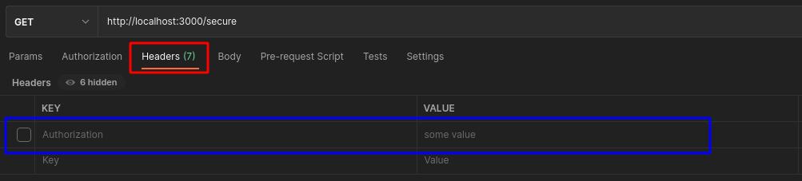
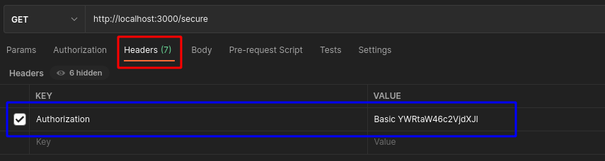

# 🔐 Exercise: Basic Authentication (HTTP Header)

In this exercise, you will implement **HTTP Basic Authentication** for a minimal Express-based REST API.

---

## 📌 Goal of this Exercise

This exercise introduces the **core idea of authentication in REST APIs**:

> The client must send credentials with every request.

By the end of this exercise, you should be able to:

- understand how authentication works via HTTP headers
- read and validate the `Authorization` header
- implement authentication using Express middleware
- distinguish between authenticated and unauthenticated requests
- understand the limitations of Basic Authentication

---

## 🧠 Context

REST APIs are **stateless**.

This means:

- the server does **not remember the client**
- every request must contain all required information
- authentication data must be sent **with every request**

Basic Authentication is one of the simplest ways to demonstrate this concept.

---

## 📡 API Overview

Your API exposes two endpoints:

| Endpoint | Description | Authentication |
|----------|------------|----------------|
| `GET /notes` | public endpoint | ❌ not required |
| `GET /secure` | protected endpoint | ✅ required |

The `/secure` endpoint must only be accessible with valid credentials.

---

## ⚙️ Step 1: Create Authentication Middleware

Create a file called `basic.js` and export a middleware function:

```javascript
export async function basicAuth(req, res, next) {
  // Implementation here
}
```

This middleware will be used to protect specific routes.

Register it in `server.js`:

```javascript
import { basicAuth } from './basic.js';

app.get('/secure', basicAuth, (req, res) => {
  res.json({ message: "This is a secure message" });
});
```

---

## 🔍 Step 2: Check for Authorization Header

Check if the request contains an `Authorization` header.

```javascript
if (!req.headers.authorization) {
  return res.status(401).json({ error: 'Missing authorization header' });
}
```

If the header is missing, return:

```http
401 Unauthorized
```

Test it:

```bash
curl http://localhost:3000/secure
```

Postman example:



---

## 🔐 Step 3: Validate Basic Authentication Format

Ensure the header uses the correct format:

```javascript
if (!req.headers.authorization.startsWith('Basic ')) {
  return res.status(401).json({ error: 'Invalid authorization format' });
}
```

Expected format:

```text
Authorization: Basic <base64(username:password)>
```

---

## 🔎 Step 4: Decode Credentials

Extract and decode the credentials:

```javascript
    
// Extract the base64-encoded username:password string
// Authorization header should look like: `Basic <base64-value>`
const base64 = req.headers.authorization.split(' ')[1];

// Decode base64 into a readable string
const decoded = Buffer.from(base64, 'base64').toString('utf8');

// Split the decoded string into username and password
const [username, password] = decoded.split(':');
```

Basic flow:

```text
username:password → base64 → sent in header → decoded on server
```

> 📘 **Explanation:**
>
> At this point, we extend the logic to validate the correct **authorization method** (i.e., Basic Auth).
>
> When we receive a valid Authorization header that starts with `Basic`, we extract the base64-encoded part (everything after the space), which should represent a string in the format `username:password`.
>
> Since browsers support [`btoa`](https://developer.mozilla.org/en-US/docs/Glossary/Base64)[ and ](https://developer.mozilla.org/en-US/docs/Glossary/Base64)[`atob`](https://developer.mozilla.org/en-US/docs/Glossary/Base64) for base64 encoding/decoding, but Node.js does not, we use [`Buffer.from(..., 'base64')`](https://nodejs.org/api/buffer.html#buffer_static_method_buffer_from_string_encoding) to decode the string.
>
> After decoding, we use `.split(':')` to separate the username and password values.
>
> We then check that both values exist. If either is missing, a `401 Unauthorized` response is returned.
>
> This logic ensures not only that an Authorization header exists, but also that it uses the **correct format and scheme**.

---

## 👤 Step 5: Validate User Credentials

Create a simple in-memory user list:

```javascript
const USERS = [
  { username: 'admin', password: 'secure' }
];
```

In a real-world application, user credentials would typically be stored in a secure database or managed through an identity provider such as [LDAP](https://ldap.com/), Active Directory, or an OAuth-compliant service.

Storing credentials directly in your application (as done here) is acceptable only for demonstration or local testing purposes. In production, this approach is considered insecure and not scalable. Always follow best practices for authentication and user management, such as:

* Password hashing (using tools like `bcrypt`, as shown in the optional step)
* Rate limiting login attempts
* Using token-based authentication (e.g., JWT) or session-based authentication securely
* HTTPS to encrypt credentials during transmission

Validation function:

```javascript
function isValidUser(username, password) {
  const user = USERS.find(u => u.username === username);
  return user && user.password === password;
}
```

Use it in middleware:

```javascript
if (!isValidUser(username, password)) {
  return res.status(401).json({ error: 'Invalid credentials' });
}
```

If valid:

```javascript
next();
```

---

## 🧪 Testing

Generate credentials:

```bash
echo -n "admin:secure" | base64
```

Example request:

```bash
curl -H "Authorization: Basic YWRtaW46c2VjdXJl" http://localhost:3000/secure
```

Postman example:




✅ That’s it! You’ve successfully implemented HTTP Basic Authentication for a REST-style Express API.

You can now:

* Add additional users to your in-memory list
* Test with other tools (Postman, curl, browser extensions)
* Extend to include roles, scopes, or logging

---

## 📌 Important Observations

Basic Authentication has important characteristics:

* credentials are sent **on every request**
* no login/logout mechanism exists
* no session is stored on the server
* the server validates credentials **each time**

This is directly aligned with REST principles.

---

## ⚠️ Limitations of Basic Authentication

Basic Authentication is **not suitable for production systems**:

* credentials are only base64 encoded (not encrypted)
* vulnerable without HTTPS
* no token lifecycle (expiration, refresh)
* no separation between authentication and authorization

> Basic Auth is used here only to understand how authentication works at the HTTP level.

---

## 🔗 Transition to Next Exercise

In the next exercise (`jwt-auth/`), you will replace Basic Authentication with a more realistic approach:

* login endpoint (`POST /auth/login`)
* token-based authentication (JWT)
* `Authorization: Bearer <token>`
* protected REST endpoints

---

## 🟢 CHECKPOINT AUTH-001

Create a short documentation including:

* request without Authorization header → result
* request with invalid credentials → result
* request with valid credentials → result
* your `basicAuth` middleware implementation

---

## 🔒 OPTIONAL: Password Hashing

Plaintext passwords should never be stored in real systems.

Install bcrypt:

```bash
npm install bcrypt
```

Generate a hashed password:

```javascript
bcrypt.hash('secure', 10).then(hash => console.log(hash));
```

Example:

```javascript
import bcrypt from 'bcrypt';

const USERS = [
  {
    username: 'admin',
    password: '$2b$10$YWh5AMNESsdk0kAckWdS.eDnkhpCvBTdZOdA0zZLv/EfO5/YI5APa'
  }
];
```

Validation:

```javascript
async function isValidUser(username, password) {
  const user = USERS.find(u => u.username === username);
  return user && await bcrypt.compare(password, user.password);
}
```

---

## 🟢 OPTIONAL CHECKPOINT AUTH-002

* add a second user
* show one successful login
* show one failed login
* document hashed passwords and validation
