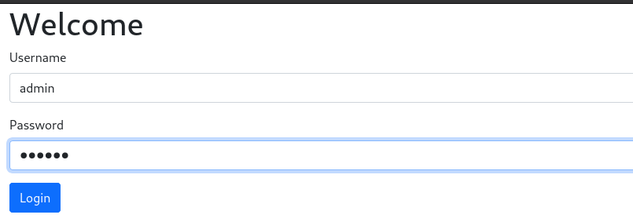
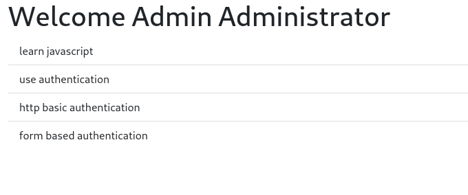
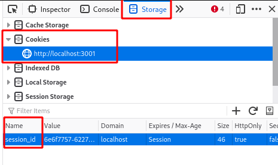
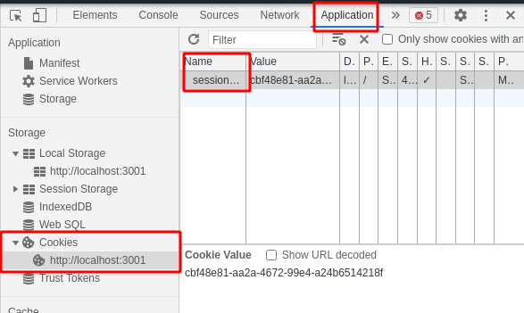

# Exercise Form Based AUTH

In this example, you will find an already implemented Form based Authentication for a WebApplication.

The webapp has three endpoints:
* `/`: which provides some static files, our 'frontend'
  * [`/index.html`](public/index.html)
  * [`/client.js`](public/client.js)
* `/login`: endpoint to do a login
* `/notes`: endpoint that provides some notes

To provide authentication, we will first `/login` from our frontend and then use **Cookies** and **Session** handling for further communication.

> Next you will find the step by step instruction on how to 'implement' this example. When you checkout the code, you will see that is already implemented. This example was a exercise from a previous year. You can take it as additional tutorial, but it will not include checkpoints for you!

## Step 1 - implement login
We already have added the endpoint `/login`, but not implemented it yet. We need to get the Post-Data from the request and check if username and password is given. Then, we need do compare them with an existing [user-database](db/users.js). As in the [basic-auth](../basic-auth/README.md) example, we simple use a in-memory alternative for our 'database'.

Open [`server.js`](./server.js) and find the `/login` endpoint implementation.

**server.js**
```javascript
// ...

// login
app.post('/login', async (req, res) => {
  if (req.body.username && req.body.password) { //check if username and password are given
    const user = await checkCredentials(req.body); // call checkCredentials, we will implement it in a moment!

    if (user) { // when user is valid, we return the user object back to our client
      return res.json({
        user
      });
    }
  }
  res.status(401).json({error: 'invalid credentials'});
});

// ...
```

> First, we check if `username` and `password` are given in our request-body. To make that work, we need to extend our express-application! so, before the declaration of our `/login` route, we have to add:
> ```javascript
> // ...
> app.use(express.urlencoded({ extended: true })); // parse urlencoded data from post/get requests
>
> app.post('/login', async (req, res) => {
> // ...
> ``` 

In our current implementation, we call the `checkCredentials` function. That function doesn't exist at this moment, so let us create it. I will use a separate file **authenticate.js** for that.

**authenticate.js**
```javascript
import { USERS } from './db/users.js'; // import USERS 'database'

/**
 * Helper-function to check credentials
 * @param {{username: string, password: string}} credentials get from request
 * @returns {{id: number, username: string, fullname: string} | undefined} user object (without password) when valid user was found
 */
export async function checkCredentials(credentials) {
  // check if user with given username exists
  const user = USERS.find((u) => u.username === credentials.username);

  // when user exists, check if given password is correct
  if (user && user.password === credentials.password) {
    const { password, ...userWithoutPassword } = user; // 'remove' password on object that will returned
    return userWithoutPassword;
  }
  return undefined;
}
```

> As in our other [exercise](../basic-auth/README.md), we first check if the given username exists in our 'database'. in the next step, we compare the passwords. instead of simple return a boolean, we return a 'clean' user object (without the password), that will be returned to the calling client

**DON'T FORGET TO IMPORT THE FUNCTION IN THE [`server.js`](server.js)!**

When everything is implemented correctly, you should be able to login into the frontend




## Step 2 - secure endpoint
We could now login from our frontend. And also get data from our `/notes`-endpoint. But that hasn't anything to do with the login, because the endpoint is not protected. We will only allow to receive data from it, when someone has a valid session.

Let's start with a [middleware](https://expressjs.com/en/guide/using-middleware.html), that checks if a valid session is given.

For that, create a new file `authorize.js` that includes our middleware-function.

**authorize.js**
```javascript
import { SESSIONS } from './db/sessions.js';

export async function authorize(req, res, next) {
  if (req.cookies) { // first, check if cookies are available
    const activeSession = SESSIONS.find(
      // search for active sessions (we will add new sessions in a moment) and compare it with cookie 'session_id'
      (session) => session.id === req.cookies.session_id
    );
    // when we found a active session, we can continoue
    if (activeSession) {
      return next();
    }
  }
  // when no cookies or active session found, we return a 401 NOT AUTHORIZED back to the client
  return res.status(401).json({ error: 'not authorized' });
}
```

> We create a middleware function, that checks the request for cookies and if a 'session_id' cookie is set with a valid session.id. The logic to add a session cookie will be implemented in a moment.

Now, we add this middleware to our `/notes` endpoint, so no unauthorized client could receive data from it any more.

**server.js**
```javascript
// ...
// import the middleware function!
import { authorize } from './authorize.js';

// ...

// add the middleware to our '/notes' endpoint. now only authorized client's could receive data from it!
app.use('/notes', authorize, notesRouter);

// ...
```

At this point, our frontend can login, but will not receive any notes any more. To fix that, we need to:
* create a new session on login
* add session cookie on login response
* *clients (browser) will return the session cookie automatically on every further request*

## Step 3 - create session and add cookie
In our `/login` endpoint-function, we need to create a new session for every (valid) user.

Extend the `/login` function inside of `server.js`

**server.js**
```javascript
// ...
// import the SESSION 'db' to add new sessions to it
import { SESSIONS } from './db/sessions.js';
// import uuid as well, to create new 'session-ids'

// ...

// login
app.post('/login', async (req, res) => {
  if (req.body.username && req.body.password) {
    const user = await checkCredentials(req.body);

    if (user) {
      // when we have a valid user, create a new session, we simple create a new uuid as id
      const session_id = uuidv4();
      // add session information to our SESSIONS 'db'
      SESSIONS.push({user, id : session_id});
      // before we return the response, add a 'session' cookie
      return res.cookie('session_id', session_id, {httpOnly: true, expires: 0, sameSite: true}).json({
        user,
      });
    }
  }
  res.status(401).json({ error: 'invalid credentials' });
});


// ...
```

> Our login will now create a new 'session' and add a session-cookie to the response. Check out your browser, if the session-cookie is correctly set.  
> In Firefox, you find the Cookies in 'Storage' -> 'Cookies'  
> 
> In Google Chrome, you find the Cookies in  'Application' -> 'Storage' -> 'Cookies'  
> 

The cookie should now be set correctly, but the client does not receive the `/notes` at all.

The reason for this is, that express does not parse cookies on it's own. We have to add a middleware/self implementation for that. We will use [cookie-parser](https://www.npmjs.com/package/cookie-parser) middleware for that.

First, install the node package.
```console
npm install cookie-parser
```

Then add the middleware to express in our `server.js`

**server.js**
```javascript
// ...
// import the module
import cookieParser from 'cookie-parser';

// add the middleware to our express-app
const app = express();
app.use(cookieParser());

// ...
```

When you now start your server again and login again, you should also receive the `/notes` again.

> Instead of self implementing the session-handling, you can/should use [express-session](https://www.npmjs.com/package/express-session) or [cookie-session](https://www.npmjs.com/package/cookie-session) middleware, as described [here](https://expressjs.com/en/advanced/best-practice-security.html#use-cookies-securely).  
> This exercise should you only show how 'easy' it is to handle sessions and give you an idea, how that modules work.

<!--
## Optional Step 4 - use hashing to secure your password
For simplicity, we simple safe username and password in plain text. That is not an good idea in a 'real' application!

Check out the [Step 5 in the Basic Auth exercise](../basic-auth/README.md#optional-step-5---use-hashing-to-secure-your-passwords) and secure your application, using hashed passwords!

> You may have to adapt something from 'basic-auth', you could not copy the code 1:1!
-->
