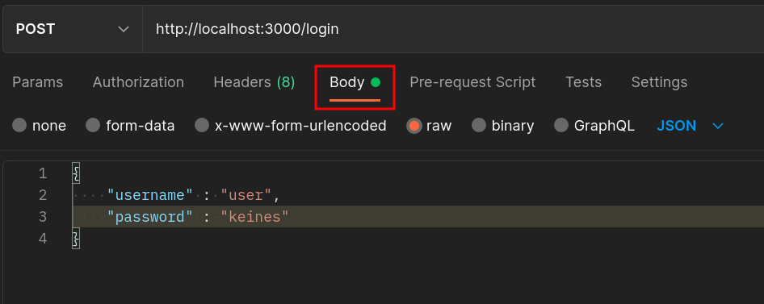
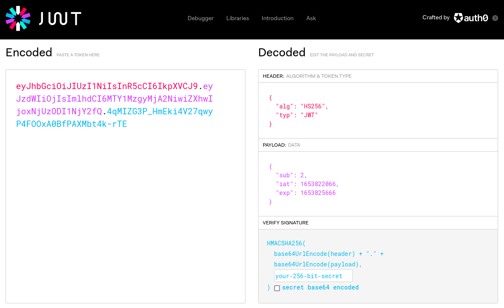

# 🔐 Exercise: JWT Authentication for REST APIs

In this exercise, you will implement **token-based authentication using JSON Web Tokens (JWT)** for a REST API built with Express.js.

---

## 📌 Goal of this Exercise

This is the **main authentication exercise** of this course.

You will extend your REST API by:

- implementing a login endpoint
- generating JWT access tokens
- protecting REST endpoints using middleware
- distinguishing between authentication and authorization

By the end of this exercise, you should be able to:

- explain how JWT-based authentication works
- implement a login flow for REST APIs
- protect endpoints using `Authorization: Bearer <token>`
- validate tokens on every request
- differentiate between `401 Unauthorized` and `403 Forbidden`

---

## 🧠 Context

In the previous exercise (Basic Auth), you learned:

> credentials are sent with every request

JWT improves this by:

- sending credentials **only once (login)**
- using a **token instead of username/password**
- allowing **stateless authentication**

REST APIs are still:

> stateless → every request must contain authentication information

---

## 🔄 Authentication Flow

```text
1. Client sends login credentials
2. Server validates credentials
3. Server returns JWT token
4. Client stores token
5. Client sends token with every request
6. Server verifies token
````

---

## 📡 API Overview

| Method | Endpoint | Protected | Description         |
| ------ | -------- | --------- | ------------------- |
| POST   | /login   | ❌         | authenticate user   |
| GET    | /me      | ✅         | return current user |
| GET    | /notes   | ✅         | list notes          |
| POST   | /notes   | ✅         | create note         |

---

## ⚙️ Step 1: Implement `/login`

The `/login` endpoint is already defined in [`server.js`](src/server.js).

You must:

* read username and password from request body
* validate credentials
* return a signed JWT token

---

### 🧩 Implementation

```javascript
app.post('/login', async (req, res) => {
  const { username, password } = req.body; // extract user credentials

  if (username && password) {
    const token = await authenticate(username, password); // call authenticate() from auth.js

    if (token) {
      return res.json({ token }); // return token if credentials were valid
    }
  }

  // fallback: return 401 Unauthorized if invalid
  res.status(401).json({ error: 'Invalid credentials' });
});
```

---

## 🔐 Step 2: Implement Token Creation

In [`auth.js`](src/auth.js), implement the `authenticate` function:

```javascript
export async function authenticate(username, password) {
  const user = USERS.find(u => u.username === username);

  if (user && user.password === password) {
    return jwt.sign(
      { sub: user.id },   // user identifier
      SECRET,
      { expiresIn: 3600 } // token valid for 1 hour
    );
  }

  return undefined; // invalid credentials
}
```

🔐 `jsonwebtoken.sign(payload, secret, options)` creates a secure token
📌 Payload contains `sub` (user id), secret is used for HMAC signing
🛑 Never store your secret in code – use environment variables in real apps!

With [jsonwebtoken](https://www.npmjs.com/package/jsonwebtoken) library, we can simple create a new JWT using the `sign` function. First, we have to provide the payload data (`{ sub: user.id }`). We need simple the user id as [sub](https://datatracker.ietf.org/doc/html/rfc7519#section-4.1.2) (subject).

The second argument will be the `SECRET` that is used for the [HMAC](https://en.wikipedia.org/wiki/HMAC). In our (*simple*) example, we use a hardcoded secret. In a 'real' application you will not provide the secret hardcoded inside of your source files. Use an environment variable for example. Also the password of the specific user could work well in such application as unique secret per user.

As third argument we provide the expire time of our token (3600 => 24 hours). You can also specify the algorithm and other stuff here. With the expire time set, we do not have to manually add some session id or check on our own if the user-session is valid after some time.


---

### 📌 Important Notes

* JWT is **signed**, not encrypted
* payload can be decoded → do NOT store sensitive data
* `sub` = subject (user id)
* `SECRET` must not be hardcoded in real applications

---

## 🧪 Test Login

```bash
curl -X POST http://localhost:3000/login \
  -H "Content-Type: application/json" \
  -d '{"username":"admin","password":"secure"}'
```



💡 Inspect your JWT at [https://jwt.io](https://jwt.io) – What’s in the payload?



---

## ⚙️ Step 3: Implement `verify` Middleware

JWT must be validated **on every request**.

Implement middleware in [`auth.js`](src/auth.js):

```javascript
export async function verify(req, res, next) {
  const authHeader = req.headers.authorization; // read Authorization header

  if (!authHeader) {
    return res.status(401).json({ error: 'Missing Authorization header' });
  }

  const [method, token] = authHeader.split(' '); // expects: Bearer <token>

  if (!/^Bearer$/i.test(method) || !token) {
    return res.status(401).json({ error: 'Invalid Authorization format' });
  }

  try {
    const decoded = jwt.verify(token, SECRET); // decode token
    req.userId = parseInt(decoded.sub); // save user ID to request object
    next(); // allow access
  } catch (err) {
    console.error(err); // log errors for demontration
    return res.status(401).json({ error: 'Invalid or expired token' });
  }
}
```

---

## 🔐 Step 4: Protect Endpoints

Example:

```javascript
app.get('/me', verify, (req, res) => {
  const { password, ...userData } = USERS.find(u => u.id === req.userId);
  res.json(userData); // return user info (excluding password)
});
```

---

## 🧪 Test Protected Endpoint

```bash
curl http://localhost:3000/me \
  -H "Authorization: Bearer <your-token>"
```

---

## ⚠️ Step 5: Add Authorization

Authentication only proves identity.

Authorization defines **permissions**.

Add an admin-only endpoint:

```javascript
app.get('/admin', verify, (req, res) => {
  const user = USERS.find(u => u.id === req.userId);

  if (user.role !== 'admin') {
    return res.status(403).json({ error: 'Forbidden' });
  }

  res.json({ message: 'Admin access granted' });
});
```

---

### 📌 Important Difference

| Status Code      | Meaning                            |
| ---------------- | ---------------------------------- |
| 401 Unauthorized | user not authenticated             |
| 403 Forbidden    | user authenticated but not allowed |

---

## 🧪 Test Authorization

* call `/admin` with normal user → expect **403**
* call `/admin` with admin → expect **200**

---

## 🟢 CHECKPOINT AUTH-002

Document:

* successful login + token
* request with valid token
* request without token → 401
* request with invalid token → 401

---

## 🟢 CHECKPOINT AUTH-003

Document:

* request to admin endpoint as normal user → 403
* request as admin → success
* explanation of 401 vs 403

---

## 🔒 OPTIONAL: Password Hashing

Install bcrypt:

```bash
npm install bcrypt
```

Update validation:

```javascript
if (user && await bcrypt.compare(password, user.password)) {
  return jwt.sign({ sub: user.id }, SECRET, { expiresIn: 3600 });
}
```

---

## 🌐 OPTIONAL: Simple Frontend

Goal:

* login form
* store JWT in localStorage
* call `/me` with token


Build a basic frontend with the following flow:

1. Display a login form (`username` + `password`)
2. Submit login to `/login`
3. Save the JWT in `localStorage`
4. Use JWT in Authorization header to call `/me`
5. Show user info in HTML


### 🗂️ Folder structure:

```
/public
  ├─ index.html
  └─ script.js
```

In `server.js`:

```js
app.use(express.static('public'));
```

---

### ✨ Example – `index.html`

```html
<!DOCTYPE html>
<html>
<head>
  <title>JWT Frontend</title>
</head>
<body>
  <h1>Login</h1>
  <form id="login-form">
    <input type="text" id="username" placeholder="Username" required />
    <input type="password" id="password" placeholder="Password" required />
    <button type="submit">Login</button>
  </form>
  <pre id="output"></pre>

  <script src="script.js"></script>
</body>
</html>
```

---

### ✨ Example – `script.js`

```javascript
const form = document.getElementById('login-form');
const output = document.getElementById('output');

form.addEventListener('submit', async (e) => {
  e.preventDefault();

  const username = form.username.value;
  const password = form.password.value;

  const res = await fetch('/login', {
    method: 'POST',
    headers: { 'Content-Type': 'application/json' },
    body: JSON.stringify({ username, password })
  });

  const data = await res.json();

  if (data.token) {
    localStorage.setItem('token', data.token);
    loadMe();
  } else {
    output.textContent = 'Login failed';
  }
});

async function loadMe() {
  const token = localStorage.getItem('token');
  const res = await fetch('/me', {
    headers: { Authorization: 'Bearer ' + token }
  });

  const user = await res.json();
  output.textContent = JSON.stringify(user, null, 2);
}
```


---

## 🔗 Next Step: WebSocket Authentication

REST:

* token sent **per request**

WebSocket:

* connection stays open
* authentication must be handled differently

In the next exercise (`ws-auth/`), you will:

* authenticate a WebSocket connection
* validate token after connection setup
* control message access

---

## 🧠 Key Takeaways

* REST is stateless → token required for every request
* JWT replaces credentials after login
* authentication ≠ authorization
* always validate tokens on the server
