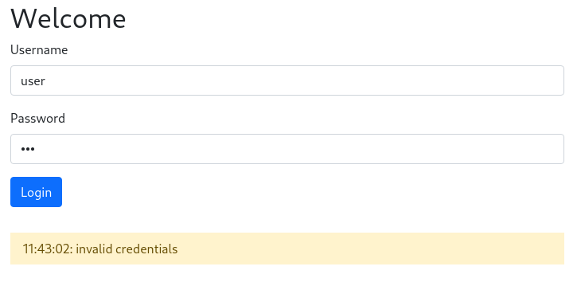
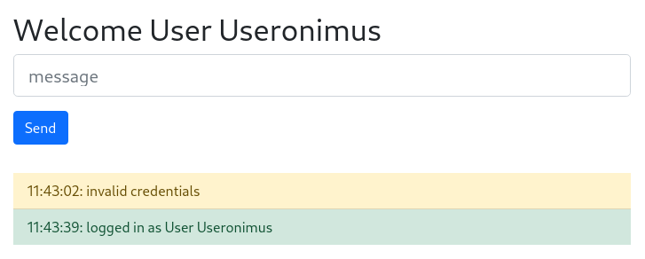

# 🔐 Exercise: WebSocket Authentication

In this exercise, you will implement **authentication for WebSocket connections**.

You can find a [Form based Authentication](../form-auth/) in another exercise, so we will here implement the authentication via WebSocket.

This builds directly on the previous exercise (`jwt-auth`), where you authenticated users in a REST API using tokens.

---

## 📌 Goal of this Exercise

You will learn:

- how authentication works in WebSocket-based systems
- why WebSocket authentication differs from REST authentication
- how to authenticate a client after connection setup
- how to restrict message handling to authenticated users

---

## 🧠 Context

### REST vs WebSocket

In REST:

- each request is independent
- authentication is sent with every request

```text
Request → Auth → Response
Request → Auth → Response
````

In WebSocket:

* connection stays open
* messages are exchanged continuously

```text
Connect → (persistent connection) → Messages
```

👉 Important:

> There is no new HTTP request per message.

---

## 🔥 Key Problem

After a WebSocket connection is established:

* there is no `Authorization` header anymore
* authentication must be handled manually

---

## 🔄 Authentication Flow (WebSocket)

```text
1. Client connects
2. Client sends authentication message
3. Server validates credentials
4. Server marks connection as authenticated
5. Client can send messages
```

---

Our web application consists of a ['client' frontend](public/), where you can log in and then send messages. in this part nothing needs to be changed for the moment.  
Check out the
* [index.html](public/index.html)
* [client.js](public/client.js)
to understand how it works.

The application consists of:

* frontend client (`public/`)
* WebSocket server (`server.js`)

The client:

* sends login credentials via WebSocket
* sends chat messages after authentication

Most of the necessary implementation is already available in [server.js](server.js). What is still missing is **"authentication"** and handling of **"msg"**-*messages*.

---

## ⚙️ Step 1: Handle Authentication Message

Our [client](public/client.js) will send websocket-messages of type **authenticate** with the `username` and `password`. It expects a response of type **authenticate** with a **success** field (boolean) and a **user** field containing the user information (without password).

The client sends a message of type:

```json
{
  "type": "authenticate",
  "username": "admin",
  "password": "secure"
}
```

Expected response:

```json
{
  "type": "authenticate",
  "success": true,
  "user": {
    "id": 1,
    "username": "admin"
  }
}
```

---

## 🧩 Implementation

We have already implemented the check of user and password several times in [basic-auth](../basic-auth) and [jwt-auth](../jwt-auth). Create your own `checkCredentials` function in which you check the user data and if they are correct return a user-object.

Inside `server.js`, extend the `authenticate` handler:

```javascript
wss.on('connection', (client) => {
  client
    .on('message', toEvent)
    .on('authenticate', (data) => {

      const user = checkCredentials(data);

      if (user) { // when we have a valid user...
        client.user = user; // append the user to our websocket-client
        client.loggedIn = true; // add a boolean field, that we can check later (on 'msg')

        clients.push(client); // add ws-client to clients, so that we can send later msg to it

        return client.send(JSON.stringify({ // return to the client, that authentication is valid
          type: 'authenticate',
          success: true,
          user
        }));
      }

      client.send(JSON.stringify({ // when we have no valid user, inform client that authentication failed
        type: 'authenticate',
        success: false
      }));
    });
});
```


> We can now 'login' into our application. Check the client and try to log  
> 
> 


---

## ⚠️ Important Concept

Authentication is done:

* **once per connection**

But this does NOT mean:

> every action is automatically allowed

---

## ⚙️ Step 2: Restrict Message Handling

Extend the `msg` handler:

```javascript
.on('msg', (data) => {
  if (!client.loggedIn) { // check, if client is successfully logged in.
    return client.send(JSON.stringify({
      type: 'error',
      message: 'Not authenticated'
    }));
  }

  clients.forEach((c) => { // send msg back to all connected/logged in clients
    c.send(JSON.stringify({
      type: 'msg',
      message: data
    }));
  });
});
```

> we simple check the set boolean value of `client.loggedIn`. A better way could be to generate some kind of "session-id" on the login and check for a valid session, but for a first example this should be enough.

---

## 🧠 Important Observation

Even after authentication:

> You must validate permissions for each action.

In this example, we only check:

* is user authenticated?

In real systems, you must also check:

* does the user have permission?

---

## 🧪 Testing

Test the following scenarios:

### ❌ Without authentication

* connect client
* send message
* expect rejection

---

### ❌ Invalid credentials

* send authenticate message with wrong data
* expect failure

---

### ✅ Valid authentication

* send correct credentials
* receive success response

---

### ✅ After authentication

* send message
* message is broadcast to all clients

---

## 🟢 CHECKPOINT AUTH-004

Document:

* failed message before authentication
* failed authentication attempt
* successful authentication
* successful message after login
* your server implementation

---

## 🔐 Important Security Notes

This example uses:

* username + password via WebSocket
* simple boolean `loggedIn`

This is NOT secure for production.

---

## 🚨 Typical Mistakes

* allowing messages before authentication
* trusting client without verification
* missing validation for each message
* no handling of invalid connections

---

## 🔗 Relation to JWT (Previous Exercise)

In the JWT exercise:

* authentication = token per request

In WebSocket:

* authentication = once per connection

---

## 🔄 Real-World Approach

In real applications:

Instead of sending username/password:

```json
{
  "type": "authenticate",
  "token": "JWT_TOKEN"
}
```

Server:

* verifies token
* extracts user info
* authenticates connection

👉 This combines REST login + WebSocket communication

---

## 🔒 OPTIONAL: Use JWT instead of Password

Replace:

```json
username + password
```

with:

```json
token
```

And verify it using:

```javascript
jwt.verify(token, SECRET)
```

---

## 🔒 OPTIONAL: Logout Handling

Implement:

```json
{
  "type": "logout"
}
```

Server:

* sets `client.loggedIn = false`
* removes user reference

---

## 🟢 OPTIONAL CHECKPOINT AUTH-005

* demonstrate logout
* show blocked messages after logout
* show re-login

---

## 🧠 Key Takeaways

* WebSocket connections are persistent
* authentication happens once per connection
* authorization must be checked per message
* REST and WebSocket authentication differ fundamentally
