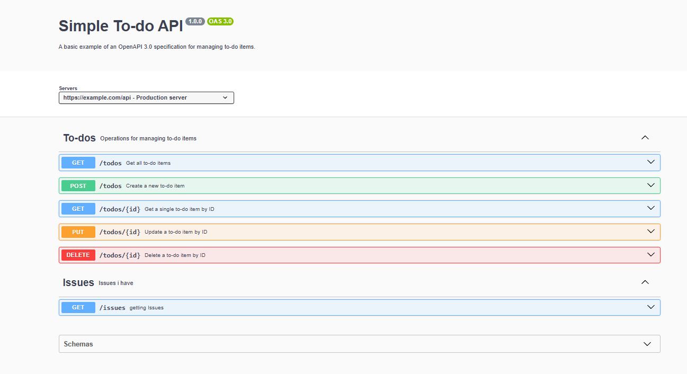

# What is OpenAPI, which problems does it solve, and how does it improve the quality and usability of APIs?

OpenAPI is a standard, language-agnostic (not dependent on the programming language,framwork,technologies) specification
for describing RESTful APIs. It is like a Blueprint / Contract for Web Services / API's readable by both humans and machines to understand the capabilities 
of a service without needing additional documentation or the actual source code

One of the biggest problems, especially in big teams is the communication between the backend and frontend teams, especially when it comes to API Design. The same problem has a big team of 
frontend developers, when everyone has a different design idea and no desing to guide them, like a figma mockup, you get a app with no consistent design. This is why OpenAPI shines the brightest in a API-First Development. Teams use OpenAPI to define the "contract" (the spec file) before writing any backend code. The frontend teams uses the spec to create mocks, while the backend team uses it as a coding guide. Similar to how frontend developers use a figma mockup to guide them how to style their app. It is even more poweful than that, provind tools for Automatisation, Live-Validation etc.

It also improves the quality of the API when developers use the OpenAPI Design they decided on, every endpoint is similar/consistent to another, creating a better DX for external users. It also enables a fast and easy way to test api's not only manualy but also generate test's and even SDK's for other languages.

In this project, OpenAPI is used to document all the todo API Endpoints and with Swagger UI, having a visible Documentation on how the API's work. It also comes with a built in testing environment, being able to not only test the get request but also all the other methodes and set parameters and querys easily

# Structure of an OpenAPI Specification

The OpenAPI spec is structured in many sections, such as info, servers, paths, components etc. The info section is like the title or the header of your api documentation, important for meta data but also for human readable docs. 

The server section includes all the servers that run the api, so the URLs it is hosted on and avaible at as well as a description, so if it is a prod,dev,testing server. 

The most important section is the paths section, containing all the details about the api endpoints and their info, like the URL path, the parameters, the request body, response etc, often defined in components. 

Components section is a libary of resuable schemas,responses,parameters etc. A example would be the /todos endpoint, using a Todo schema array as it response and using it again in the /todo/{id} path, this time not in a array. 

Most of the information in the OpenAPI file you see you can also see in the SwaggerUI, like the paths, schemas, info etc.

## Bonus - How a tag section affects SwaggerUI

Adding a new tag section, with corresponding data such as parameters and components used in it shows another section with defined paths. These paths are categorized to each tag.

# Creating own Endpoint

The Endpoint `/issues` is a new type of endpoint for a different type of tag, it returns all Issue items. It does not except any type of input, as it is a GET Request. It returns a Issue item, defined in the components/schema section. If a error occurs, a 500 Internal Server Error Status Code is sent. It does not match the current server implementation.