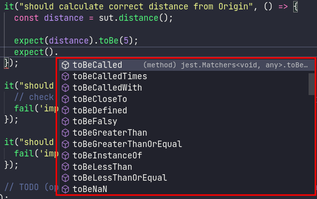

# JavaScript testing with JEST

This exercise introduces you to testing JavaScript (**Node.js**) using [JEST](https://jestjs.io/). Jest is a powerful and user-friendly testing framework that works out of the box with JavaScript projects, providing a smooth testing experience.

### Prerequisites.

Before starting, ensure you have a working Node.js environment:
* install [Node.js](https://nodejs.org/en/) (LTS recommended)
* install [`npm`](https://www.npmjs.com/) or [`yarn`](https://classic.yarnpkg.com/en/)

Clone the example repository and install dependencies:

```console
$ git clone https://git-iit.fh-joanneum.at/msd-webserv/ss25-exercies/testing
$ cd testing/0_jest/
$ npm install
```

### Add jest to the Project.
Before you can execute the tests, you need to add JEST to the Project. For that, add the JEST-Module via `npm`/`yarn` as development dependency.
```console
$ npm i -D jest
```

> If you want to have intellisence for `jest` in VS Code (*may also works in other editors/ides*), install [@types/jest](https://www.npmjs.com/package/@types/jest) as well  
> 

After that, you should be able to run the existing tests.
```console
$ npm test
```

As you can see, there is no additional configuration required, to run the tests. This is one of the big advantages of JEST.

You may also noticed, that the tests are not all green...
Some tests might fail initially – **your task will be to fix them**!

### Fix failing tests.
Now, get familiar with the syntax of JEST. In [test.js](./test.js) you can find some predefined tests. Some are for illustration. Fix the **TODO** and `fail`ing tests.

If you need more detailed information, take a look into the [JEST API Reference](https://jestjs.io/docs/en/api).

## Step by Step Guide
Jest is a delightful JavaScript Testing Framework with a focus on simplicity. It works out of the box for any React project and is well-suited for testing any JavaScript code. Developed by Facebook, Jest is used by companies all around the globe and is considered a standard tool in modern web development. Its main goals are to provide a powerful, yet user-friendly testing platform that can handle a wide range of testing needs, from unit testing to integration and end-to-end testing. Here’s a step-by-step introduction to getting started with Jest:

### Step 1: Installation

First, you need to install Jest. Assuming you have a Node.js project set up, you can add Jest by running:

```bash
npm install jest
```
This ensures Jest is included as a development dependency and will not be included in production builds.

### Step 2: Writing Your First Test

Create a file named `sum.js` with a simple function to test:

```javascript
function sum(a, b) {
  return a + b;
}
module.exports = sum;
```

Then, create a corresponding test file `sum.test.js`  in the same directory:

```javascript
const sum = require('./sum');

test('adds 1 + 2 to equal 3', () => {
  expect(sum(1, 2)).toBe(3);
});
```

for more information about Test File Location & Naming Conventions take a look at [Jest Overview](../jest.md)

This file contains your test. The `test` function takes two arguments: a string describing the test and a function containing the expectations to test.

### Step 3: Running Your Tests

Add the following section to your `package.json`:

```json
"scripts": {
  "test": "jest"
}
```

Now, you can run your tests by executing:

```bash
npm test
```

### Step 4: Understanding Jest Output

After running the tests, Jest will provide you with a summary of the tests that passed or failed, along with detailed error messages for failures. This helps you quickly identify and fix issues.

- ✅ Passed tests
- ❌ Failed tests (with error details for debugging)

### Step 5: Exploring More Features

Jest offers a wide array of features beyond basic testing, including:

- **Snapshot Testing**: Useful for ensuring your UI does not change unexpectedly.

```
expect(component).toMatchSnapshot();
```

- **Mock Functions**: Allows you to test the links between code by erasing the actual implementation of a function, capturing calls to the function (and the parameters passed in those calls), capturing instances of constructor functions when instantiated with `new`, and allowing test-time configuration of return values.

```
const mockFn = jest.fn();
mockFn("Hello");
expect(mockFn).toHaveBeenCalledWith("Hello");
```

- **Asynchronous Testing**: Supports testing of asynchronous code with simplicity and flexibility.

```
test("fetches data", async () => {
  const data = await fetchData();
  expect(data).toBeDefined();
});
```

- **Coverage Reports**: Easily generate coverage reports by adding the `--coverage` flag to your test script in `package.json`.

```
npm test -- --coverage
```

### Conclusion

Jest is a robust testing framework designed for simplicity and efficiency. It supports:

- Unit tests for JavaScript and Node.js applications.
- Snapshot testing for UI components.
- Mocking for efficient function testing.
- Coverage reporting for better test insights.

By integrating Jest into your workflow, you can ensure code reliability and maintainability in both small and large projects.

🚀 Start testing with Jest today!